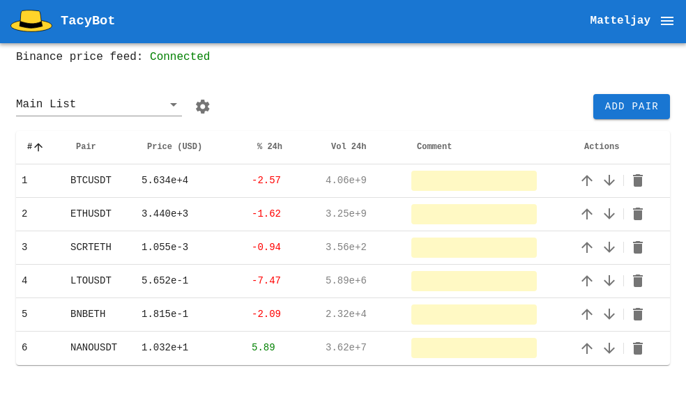
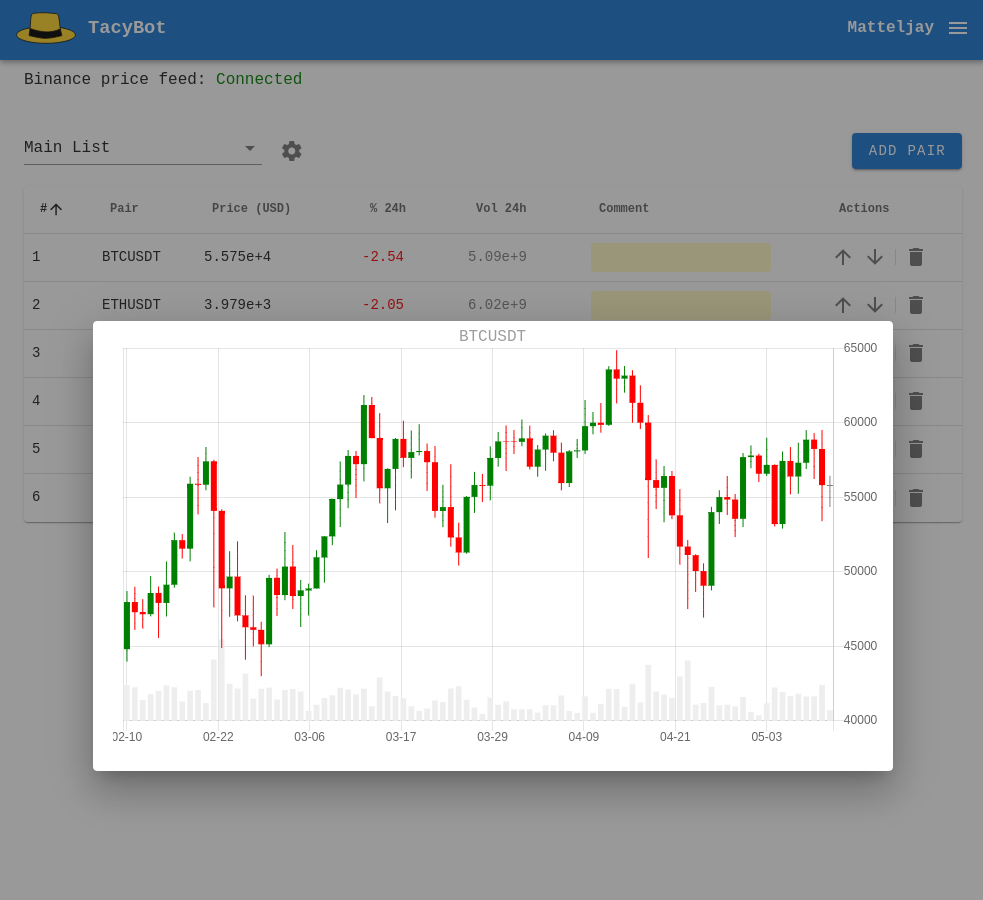
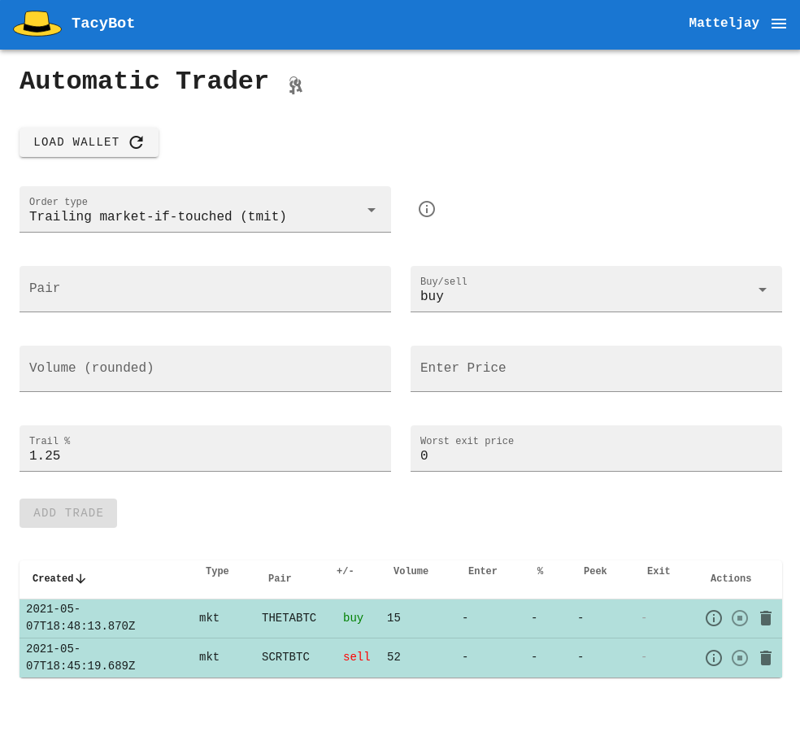

# TacyBot

## Smart trading terminal

- License: MIT License
- Author: Matteljay
- Language: Vue/JavaScript
- IDE: Visual Studio Code
- Homepage: https://libersystems.com

## Table of contents

- [About](#about)
- [Screenshots](#screenshots)
- [Usage](#usage)
  - [Dashboard](#dashboard)
  - [User Info](#user-info)
  - [Trader](#trader)
- [Installation](#installation)
- [Technical details](#technical-details)
- [Contact info & donations](#contact-info--donations)

## About

TacyBot is a cryptocurrency trading platform written in [Vue.JS](https://vuejs.org/). With the full stack implementation, TacyBot can automatically execute advanced trades in the background. Buy and sell triggers are based on current market conditions and will be automatically executed using your [Binance.com account](https://accounts.binance.com). A custom portfolio builder is included so you can monitor the real-time prices of your custom selection of assets. With one click, a price chart with daily price candles is generated for your preferred cryptocurrency. It was loosely inspired by the functionality of [3Commas](https://3commas.io/). But this is a completely open source version that you can audit and run in a standalone way on any [VPS](https://en.wikipedia.org/wiki/Virtual_private_server) as a Docker micro-service.
A user account management system is included so that multiple users can be accommodated from one server. The application is already running live here: [tacy.libersystems.com](https://tacy.libersystems.com), it is a responsive and mobile friendly web-app. You can start by requesting an account. DISCLAIMER: all trading activities are done at your own risk, no guarantee of any kind is given.

Introduction video: [libersystems.com](https://libersystems.com/uploads/videos/tacybot.mp4) [bitchute.com](https://www.bitchute.com/video/WjvXxP5b27QZ/)

## Screenshots







## Usage

This section has documentation for the end-user. To install and use the source code yourself, go to the [Installation section](#installation). Request an account on [tacy.libersystems.com](https://tacy.libersystems.com/). Wait for it to get approved or send an e-mail to *matteljay [at] pm [dot] me*.

### Dashboard

After logging in you get forwarded to your personal price ticker dashboard. Here you can add cryptocurrency pairs. The abbreviations like *LTCUSDT* can be found on [binance.com/en/markets](https://www.binance.com/en/markets), use these in the *Add pair* dialog. Several different pages with different pairs can be added to your personal dashboard. These steps are also shown in the introduction video above. Note that contrary to other crypto price listings, TacyBot lists the prices in [scientific notation](https://en.wikipedia.org/wiki/Scientific_notation). That way the amount of information you get per price is constant. For example, a price of *0.00003* is hard to quantify and has less data than *3.246e-5*. A price of *35742* has too much data, *3.574e+4* removes some irrelevancy.

### User Info

Open the menu pane by clicking the 3-bar symbol (hamburger icon) in the upper right corner. Then click *User Info*. TacyBot includes a flexible user account management section. Here you can change your optional *Display name*. Your password is needed to confirm the change. If you click *Change Login Credentials*, you can even change your e-mail address and password. Again, your old password is required to confirm this.

### Trader

On the menu pane, click *Trader*. This page enables you to get your Binance wallet contents and enables advanced stand-alone trading by the TacyBot server back-end. To enable this, first your trading account on Binance needs to be configured correctly. Generate an API key pair (label & secret), as is explained in the introduction video. Your Binance keys can be accessed on your account page as shown here, make sure to check the same permission boxes and *IP privileges* option.


TacyBot requires you to copy-paste the key pair into the Trader dialog. For this, open the *keys* symbol and paste the keys there. Now you can load your Binance wallet balance quickly & easily.
Additionally, you now enabled the option to perform advanced automated trades. For every trade you write, it is important to **round** the volume you use as much as possible. Otherwise Binance will throw obscure errors such as *LOT_SIZE*. These are pretty harmless but may result in your order failing to trigger at the time and market conditions you wanted. To understand such error messages, Binance provides and explanation on their [API documentation](https://binance-docs.github.io/apidocs/spot/en/#filters).

There are four different types of trades possible, every time the *ETHUSDT* pair is used as an example here.
- Instant market (mkt)
  - *BUYING:* Instantly buy [volume] amount of ETH
  - *SELLING:* Instantly sell [volume] amount of ETH
- Market-if-touched (mit)
  - *BUYING:* Buy [volume] amount of ETH if higher [enterPrice] in USDT is reached
  - *SELLING:* Sell [volume] amount of ETH if lower [enterPrice] in USDT is reached
- Trailing market (tmkt)
  - *BUYING:* Buy [volume] amount of ETH if the price rises above [percentage] of the lowest peek price. Use this if you want to buy ETH but you want to wait and see how low the price can go.
  - *SELLING:* Sell [volume] amount of ETH if the price falls below [percentage] of the highest peek price. Use this if you want to sell ETH but you want to wait and see how high the price can go.
- Trailing market-if-touched (tmit)
  - *BUYING:* Buy [volume] amount of ETH if higher [enterPrice] in USDT is reached, then SELL back to USDT if the price drops below [percentage] of the highest peek price. Useful for trading breakouts above price resistance.
  - *SELLING:* Sell [volume] amount of ETH if lower [enterPrice] in USDT is reached, then BUY back ETH if the price rises above [percentage] of the lowest peek price. Useful for trading breakdown below price resistance.

When the order is waiting to get executed, it is colored white. When the order finished successfully, it gets colored green. When the order finishes with an error, it is colored red and you can click the *(i)* symbol to find out why. The square symbol will manually halt and disable the trade, the trash symbol will both halt the trade and remove it from your account history.

## Installation

Instead of using [tacy.libersystems.com](https://tacy.libersystems.com/), you can also run it on your own server. It is assumed you're already a server admin and manage your own VPS. This section explains how to install TacyBot using Docker and will run it as a micro-service that you can tweak via the [docker-compose.yml](docker-compose.yml).

A modern VPS should already have [Docker](https://docs.docker.com/engine/install/) and [Docker Compose](https://docs.docker.com/compose/install/) installed. These few commands offer the fastest startup & working demonstration.
```
mkdir -p tacybot/tacy-db
chown 1000:1000 tacybot/tacy-db
cd tacybot/
wget https://github.com/Matteljay/tacybot/raw/main/docker-compose.yml
docker-compose up -d
```
A TacyBot demo should now be available from the internet at `http://your-server-ip:5000`. The first user you add will automatically become the approved administrator. You will notice the *Admin* page on your menu pane. The admin account has the ability to approve new users or reset passwords for other users.

For a more trustworthy environment, you definitely should enable SSL/TLS and personalize your [docker-compose.yml](docker-compose.yml). The content of variables `JWT_SECRET` and `USER_PW_SALT` should both be replaced by passwords or random characters of your choosing (around 8 - 32 characters in length). Also look into more security features from my [other project](https://github.com/matteljay/tightcms#important-tweaks-and-security-notes).

## Technical details

TacyBot's front-end is a responsive and routerless [SPA](https://en.wikipedia.org/wiki/Single-page_application). It connects both via encrypted WebSocket as well as regular Rest API via Axios to establish communication lines between 3 parties: front-end, back-end and Binance server. A complete user management system is included with some basic spam protections. The user is able to manage their own private data completely. A high degree of login privacy is respected via both client-side and server-side password hashing & salting before storing in NeDB.

Technologies used:
- Vue.JS modern JavaScript framework
- Vuex memory state management
- Vuetify components (dialogs, buttons, bootstrap-based style,...)
- Express Node.JS server
- [NeDB-Async](https://github.com/Akumzy/nedb-async) Database
- Docker container services
- Using and writing JSON Web APIs
- Smartphone-friendly CRUD operations
- Web security and authentication via JWT tokens
- WebSocket clients & servers

The size of the code base is approximately 3200 lines, broken down here:
- 14 components: 2050
- 4 Vuex store modules: 200
- root components: 170
- Total front-end: 2420
- Total back-end: 780

## Contact info & donations

More info here: [Contact](CONTACT.md), [QR-codes](donate-qr.png)
